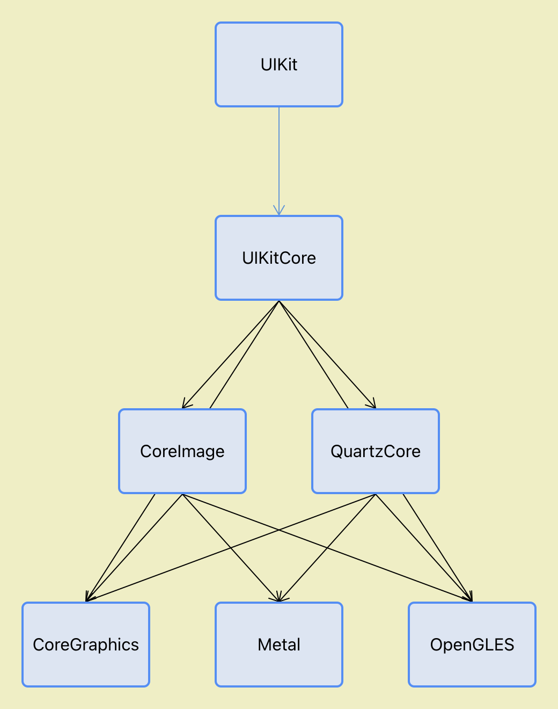
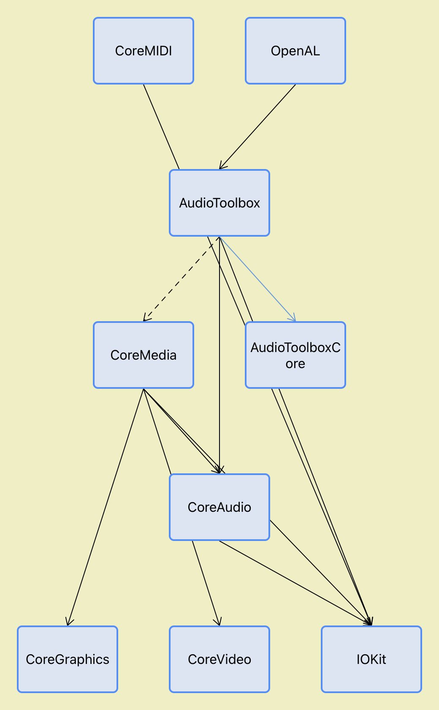

# Framework Graph
A simple tool for generated the dependency graph between frameworks and libraries. 

Only work in Simulator.

## Example
### Graph for "render" related frameworks

### Graph for "audio" related frameworks

