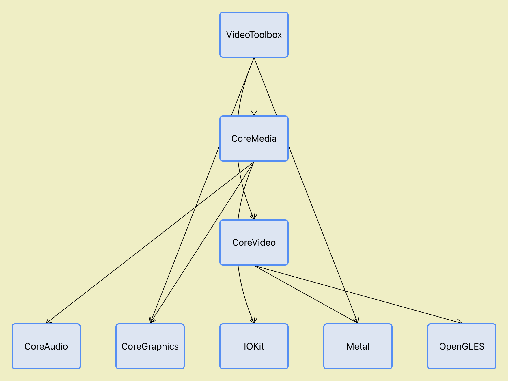
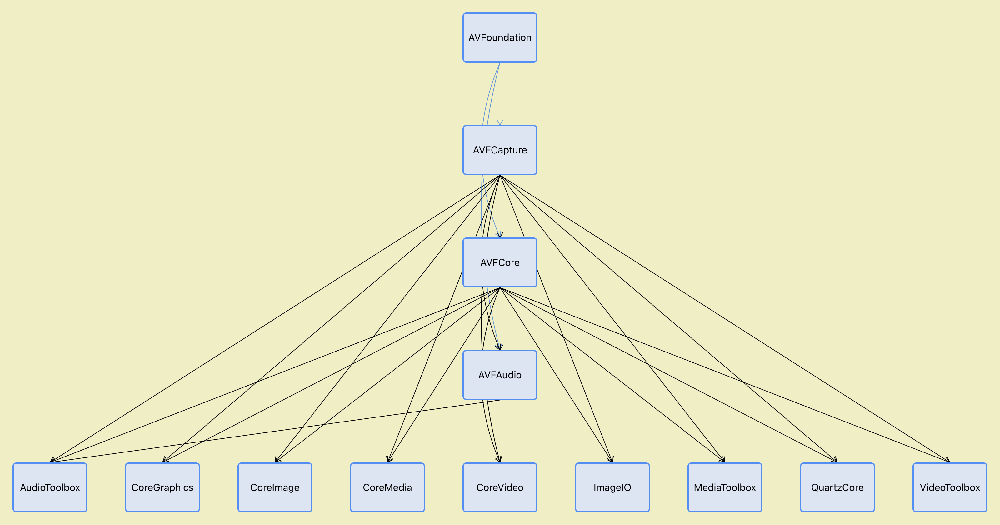

# Framework Graph
A simple tool for generated the dependency graph between frameworks and libraries. 

Dependency type:
- Black solid lines stand for strong dependency (LC_LOAD_DYLIB);
- Black dash lines stand for weak dependency (LC_LOAD_WEAK_DYLIB);
- Blue solid lines stand for reexport dependency (LC_REEXPORT_DYLIB);
- Red solid lines stand for circular dependency;

Only work in Simulator.

## Example
### Graph for "render" related frameworks

### Graph for "audio" related frameworks

### Graph for "video" related frameworks

### Graph for "AVFoundation" related frameworks

